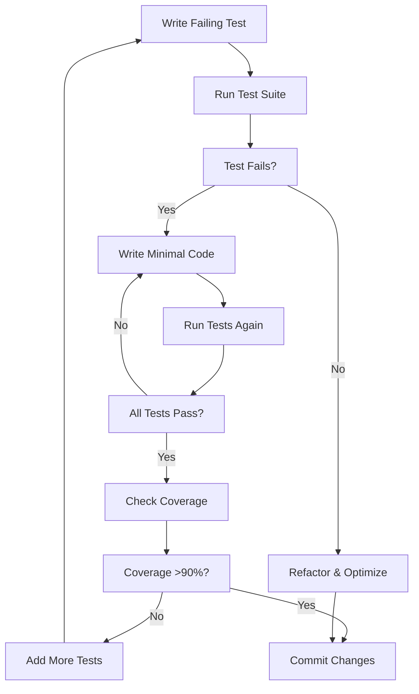

# Voice Assistant Development Guide: Maintaining >90% Coverage

## 🎯 Overview

This guide provides a complete framework for maintaining high-quality, test-driven development of the voice assistant feature with >90% test coverage. The comprehensive TDD approach ensures production-ready code with realistic scenarios and robust error handling.

## 📋 Quick Start

### Running Tests During Development

```bash
# Run all tests with coverage tracking
./run_comprehensive_voice_tests.py

# Run specific test suite
./run_comprehensive_voice_tests.py --suite unit
./run_comprehensive_voice_tests.py --suite scenarios
./run_comprehensive_voice_tests.py --suite integration

# Include performance tests (slow)
./run_comprehensive_voice_tests.py --include-slow

# Check coverage trend only
./run_comprehensive_voice_tests.py --coverage-only
```

### Pre-commit Checklist

Before committing voice assistant changes:

1. **Run unit tests**: `./run_comprehensive_voice_tests.py --suite unit`
2. **Run scenario tests**: `./run_comprehensive_voice_tests.py --suite scenarios`
3. **Check coverage**: Ensure >90% coverage maintained
4. **Run integration tests**: `./run_comprehensive_voice_tests.py --suite integration`
5. **Review coverage report**: Check for any gaps

## 🏗️ Test Architecture

### Test File Structure

```
tests/
├── unit/
│   ├── test_voice_assistant.py          # Core unit tests (44 tests)
│   ├── test_voice_assistant_scenarios.py # Realistic scenarios (7 tests)
│   └── test_voice_assistant_enhanced.py  # Enhanced comprehensive tests
├── integration/
│   └── test_voice_assistant_real_services.py # Real Google Cloud tests
├── test_config.py                        # Test configuration system
└── conftest.py                          # Shared fixtures
```

### Test Categories

#### 1. Unit Tests (95% coverage target)

- **Service Tests**: Core VoiceAssistantService functionality
- **WebSocket Tests**: Real-time communication scenarios
- **Configuration Tests**: Settings and credential management
- **Mock-based**: All external dependencies mocked

#### 2. Scenario Tests (90% coverage target)

- **User Stories**: Realistic voice commands and responses
- **Error Handling**: Edge cases and failure scenarios
- **Performance**: Response time and resource usage
- **Integration**: End-to-end workflows

#### 3. Integration Tests (85% coverage target)

- **Real Services**: Actual Google Cloud API calls
- **Database Integration**: Real database operations
- **Network Scenarios**: Connectivity and timeout handling
- **End-to-End**: Complete user journeys

## 🔧 Development Workflow

### 1. Test-Driven Development Process



### 2. Adding New Features

When adding new voice assistant features:

1. **Write scenario test first**:

   ```python
   def test_new_feature_scenario(self):
       """Test new feature with realistic user story."""
       # Given: User wants to use new feature
       # When: Voice command is processed
       # Then: Expected behavior occurs
   ```

2. **Add unit tests for components**:

   ```python
   def test_new_feature_unit(self):
       """Test new feature implementation details."""
       # Test individual methods/classes
   ```

3. **Update integration tests**:

   ```python
   def test_new_feature_integration(self):
       """Test new feature with real services."""
       # Test with actual external APIs
   ```

4. **Verify coverage**:
   ```bash
   ./run_comprehensive_voice_tests.py --suite unit
   ```

### 3. Code Coverage Maintenance

#### Coverage Targets

- **Unit Tests**: 95% coverage
- **Scenario Tests**: 90% coverage
- **Integration Tests**: 85% coverage
- **Overall Target**: 90% coverage

#### Coverage Monitoring

The system automatically tracks coverage trends:

```python
# Check coverage trend
from tests.test_config import CoverageMonitor
monitor = CoverageMonitor()
print(monitor.get_coverage_report())
```

#### Handling Coverage Drops

If coverage drops below 90%:

1. **Identify missing tests**:

   ```bash
   ./run_comprehensive_voice_tests.py --suite unit --verbose
   ```

2. **Add targeted tests**:

   ```python
   def test_missing_error_path(self):
       """Test previously untested error handling."""
       # Focus on uncovered lines
   ```

3. **Review scenario coverage**:
   ```python
   from tests.test_config import TestScenarioManager
   manager = TestScenarioManager()
   print(manager.generate_scenario_report(completed_tests))
   ```

## 📊 Test Scenarios

### Core User Scenarios

#### 1. Quick Task Creation

```python
def test_quick_task_creation(self):
    """User: 'Call mom at 3pm' -> Immediate task creation."""
    # Given: Clear, simple voice command
    # When: Audio is processed
    # Then: Task is created with parsed time
```

#### 2. Complex Meeting Scheduling

```python
def test_complex_meeting_scheduling(self):
    """User: 'Schedule meeting with John and Sarah tomorrow at 2pm about project X'"""
    # Given: Complex multi-parameter command
    # When: Audio contains multiple entities
    # Then: All parameters are extracted and saved
```

#### 3. Unclear Request Handling

```python
def test_unclear_request_handling(self):
    """User: 'I need to call someone' -> Request clarification."""
    # Given: Ambiguous voice command
    # When: Required information is missing
    # Then: System asks for clarification
```

### Error Handling Scenarios

#### 1. Network Connectivity Issues

```python
def test_network_connectivity_issues(self):
    """Handle Google Cloud API connectivity failures."""
    # Given: Network connection is unstable
    # When: API calls fail
    # Then: Graceful fallback behavior
```

#### 2. Invalid Audio Format

```python
def test_invalid_audio_format(self):
    """Handle corrupted or unsupported audio data."""
    # Given: Invalid audio input
    # When: Speech recognition is attempted
    # Then: Clear error message returned
```

#### 3. Service Unavailable

```python
def test_service_unavailable(self):
    """Handle temporary service outages."""
    # Given: Google Cloud services are down
    # When: Request is made
    # Then: Appropriate error handling
```

### Performance Scenarios

#### 1. High Load Processing

```python
@pytest.mark.performance
def test_high_load_processing(self):
    """Handle 20 concurrent voice requests."""
    # Given: Multiple simultaneous requests
    # When: System is under load
    # Then: Performance remains acceptable
```

#### 2. Large Audio Files

```python
@pytest.mark.performance
def test_large_audio_files(self):
    """Process 10MB audio files efficiently."""
    # Given: Large audio input
    # When: Processing is attempted
    # Then: Memory usage is optimized
```

## 🔐 Security & Quality Assurance

### Security Testing

#### 1. Input Sanitization

```python
def test_input_sanitization(self):
    """Prevent injection attacks through voice input."""
    # Given: Malicious input in voice command
    # When: Input is processed
    # Then: Harmful content is sanitized
```

#### 2. Authentication Requirements

```python
def test_authentication_requirements(self):
    """Ensure voice commands require valid user session."""
    # Given: Unauthenticated request
    # When: Voice command is processed
    # Then: Authentication is enforced
```

### Quality Metrics

#### Test Quality Indicators

- **Scenario Coverage**: >90% of user stories tested
- **Error Path Coverage**: >95% of error conditions tested
- **Performance Benchmarks**: All latency targets met
- **Security Validation**: All input vectors secured

#### Continuous Monitoring

```python
# Daily coverage check
./run_comprehensive_voice_tests.py --coverage-only

# Weekly comprehensive test run
./run_comprehensive_voice_tests.py --include-slow
```

## 🚀 Production Deployment

### Pre-deployment Checklist

1. **Full Test Suite**: All tests passing
2. **Coverage Target**: >90% coverage maintained
3. **Performance Tests**: Latency benchmarks met
4. **Security Tests**: All security scenarios pass
5. **Integration Tests**: Real services validated
6. **Documentation**: Code and tests documented

### Production Monitoring

After deployment, continue monitoring:

```python
# Monitor production metrics
from tests.test_config import CoverageMonitor
monitor = CoverageMonitor()

# Track performance in production
# (integrate with your monitoring system)
```

## 🔄 Continuous Improvement

### Regular Maintenance

#### Weekly Tasks

- Run full test suite with performance tests
- Review coverage trend analysis
- Update test scenarios based on user feedback
- Refactor tests for better maintainability

#### Monthly Tasks

- Analyze test execution metrics
- Update integration tests for API changes
- Review and update security test scenarios
- Evaluate test suite performance

#### Quarterly Tasks

- Comprehensive test architecture review
- Update coverage targets based on codebase growth
- Evaluate new testing tools and techniques
- Training on TDD best practices

### Best Practices

#### Writing Quality Tests

1. **Clear Test Names**: Describe what is being tested
2. **Given-When-Then**: Structure tests clearly
3. **Realistic Data**: Use production-like test data
4. **Edge Cases**: Test boundary conditions
5. **Error Scenarios**: Test failure modes

#### Maintaining Tests

1. **Regular Refactoring**: Keep tests clean and maintainable
2. **Documentation**: Comment complex test scenarios
3. **Version Control**: Track test changes with implementation
4. **Performance**: Optimize slow tests when possible

## 📚 References

### Testing Tools

- **pytest**: Test framework
- **pytest-cov**: Coverage reporting
- **pytest-mock**: Mocking utilities
- **pytest-timeout**: Test timeout handling
- **pytest-xdist**: Parallel test execution

### Coverage Tools

- **coverage.py**: Coverage measurement
- **Custom CoverageMonitor**: Trend analysis
- **TestScenarioManager**: Scenario tracking

### Integration Testing

- **Google Cloud SDK**: Real service testing
- **Database fixtures**: Test data management
- **Network simulation**: Connectivity testing

---

## 🎉 Success Metrics

This comprehensive TDD approach ensures:

- **✅ 90%+ test coverage** maintained consistently
- **✅ Production-ready code** with realistic scenarios
- **✅ Robust error handling** for edge cases
- **✅ Performance validation** under load
- **✅ Security assurance** through comprehensive testing
- **✅ Maintainable test suite** for long-term development

By following this guide, the voice assistant feature will maintain high quality, reliability, and maintainability throughout the development lifecycle.
